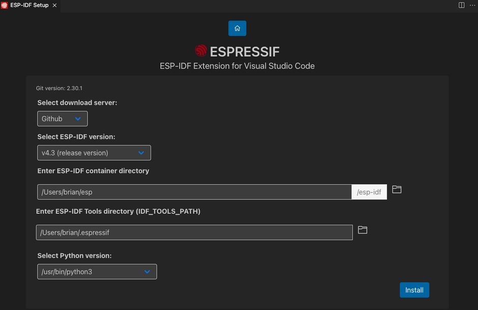

# **Passo a Passo para Configurar e Executar o Projeto com ESP-IDF**

Este guia detalha como configurar e executar um projeto utilizando o **ESP-IDF** no sistema operacional **Ubuntu**, com suporte ao **VSCode** e à extensão oficial da Espressif.

---

## **Pré-requisitos**

### **1. Instalar Dependências do Sistema**
Antes de começar, certifique-se de que todas as dependências necessárias estão instaladas no Ubuntu. Execute os seguintes comandos no terminal:

```bash
sudo apt-get update
sudo apt-get install git wget flex bison gperf python3 python3-pip python3-venv cmake ninja-build ccache libffi-dev libssl-dev dfu-util libusb-1.0-0
```

### **2. Instalar a Extensão ESP-IDF no VSCode**
No Visual Studio Code, instale a extensão oficial [ESP-IDF](https://marketplace.visualstudio.com/items?itemName=espressif.esp-idf-extension). Essa extensão facilitará a configuração e execução do ambiente de desenvolvimento.

---

## **Configuração do Ambiente ESP-IDF**

### **1. Clonar o Repositório do ESP-IDF**
Crie um diretório para armazenar o ESP-IDF e clone o repositório oficial:

```bash
mkdir -p ~/esp
cd ~/esp
git clone --recursive https://github.com/espressif/esp-idf.git
```

> **Nota:** O uso da flag `--recursive` é essencial para clonar todos os submódulos necessários.

---

### **2. Instalar Ferramentas do ESP-IDF**
Dentro do diretório do ESP-IDF, execute o script de instalação para baixar e configurar as ferramentas necessárias:

```bash
cd ~/esp/esp-idf
./install.sh esp32
```

---

### **3. Configurar Variáveis de Ambiente**
Adicione um alias ao arquivo `.bashrc` para facilitar o carregamento das variáveis de ambiente do ESP-IDF sempre que necessário:

```bash
echo "alias get_idf='. $HOME/esp/esp-idf/export.sh'" >> ~/.bashrc
source ~/.bashrc
get_idf
```

Agora, você pode usar o comando `get_idf` no terminal para carregar as variáveis de ambiente do ESP-IDF.

---

## **Configuração da Extensão no VSCode**

1. Abra o VSCode.
2. Pressione `Ctrl+Shift+P` para abrir a paleta de comandos.
3. Pesquise por **"Configure ESP-IDF Extension"** e selecione a opção correspondente.
4. Siga o assistente para configurar o caminho do ESP-IDF, Python e as ferramentas necessárias.



> **Importante:** Certifique-se de que o VSCode esteja aberto na pasta específica do projeto (não no diretório raiz) para evitar problemas de configuração.

---

## **Executando o Projeto**

Após a configuração inicial, você tem duas opções para executar e gerenciar seu projeto: **utilizando os recursos da extensão no VSCode** ou **executando os comandos diretamente no terminal**. Ambas as abordagens são equivalentes em funcionalidade, então escolha a que melhor se adapta ao seu fluxo de trabalho.

---

### **Opção 1: Usando a Extensão do VSCode**

A extensão do ESP-IDF oferece uma interface gráfica conveniente para realizar as principais tarefas. No rodapé do VSCode, você encontrará botões dedicados para:

- **Build**: Compila o projeto.
- **Flash**: Grava o firmware na placa.
- **Monitor**: Abre o monitor serial para visualizar logs e saídas.
- **Clean**: Limpa os arquivos gerados durante a compilação.

Basta clicar nos ícones correspondentes no rodapé do VSCode para executar essas ações.

---

### **Opção 2: Usando Comandos no Terminal**

Se preferir trabalhar diretamente no terminal, utilize os seguintes comandos:

#### **1. Configurar o Projeto**
Execute o comando abaixo para acessar o menu de configuração do projeto:

```bash
idf.py menuconfig
```

Após realizar as configurações desejadas, pressione `Q` para sair.

#### **2. Compilar o Projeto**
Para compilar o código-fonte, execute:

```bash
idf.py build
```

#### **3. Flashar o Firmware**
Conecte sua placa ESP32 ao computador via USB e execute o comando abaixo para gravar o firmware:

```bash
idf.py flash
```

#### **4. Monitorar a Saída Serial**
Para monitorar a saída serial da placa, use o comando:

```bash
idf.py monitor
```

Para sair do monitor, pressione `Ctrl+]`.

---

### **Resumo dos Métodos de Execução**

| Método                          | Como Acessar                                                                 |
|---------------------------------|------------------------------------------------------------------------------|
| **Extensão do VSCode**          | Clique nos botões no rodapé do VSCode (Build, Flash, Monitor, etc.).         |
| **Comandos no Terminal**        | Use os comandos `idf.py build`, `idf.py flash`, `idf.py monitor`, etc.       |

Ambas as abordagens são igualmente eficazes. Se você prefere uma interface gráfica e mais intuitiva, a extensão do VSCode é ideal. Por outro lado, se você gosta de ter controle total e prefere usar o terminal, os comandos `idf.py` são a melhor escolha.

---

## **Considerações Importantes**

### **1. Alterar Credenciais de Rede**
Sempre que utilizar uma nova rede Wi-Fi, atualize as credenciais no código-fonte ou no menu de configuração (`idf.py menuconfig`).

---

### **2. Permissões de Acesso à Porta USB**
Se você encontrar problemas de permissão ao acessar a porta USB, adicione seu usuário ao grupo `dialout`:

```bash
sudo usermod -aG dialout $USER
```

Em seguida, reinicie o computador para aplicar as alterações.

---

## **Resumo dos Comandos Principais**

| Comando              | Descrição                                   |
|----------------------|---------------------------------------------|
| `idf.py menuconfig`  | Configurar o projeto                       |
| `idf.py build`       | Compilar o projeto                         |
| `idf.py flash`       | Gravar o firmware na placa                 |
| `idf.py monitor`     | Monitorar a saída serial                   |

---

Com isso, seu ambiente estará configurado e pronto para desenvolver projetos com o ESP-IDF! Caso tenha dúvidas ou encontre problemas, consulte a [documentação oficial do ESP-IDF](https://docs.espressif.com/projects/esp-idf/en/latest/) ou entre em contato com a equipe de suporte.